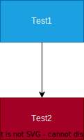

# Note

## Backend

- bases
  - server
    - http
    - https
    - keep-alive
    - graceful shutdown
  - handler
    - scope
    - guard
      - ex. only "content-type: application/json"
  - extractor
    - path
    - request parameters
    - json
    - forms
  - error-handling
  - database
- tools
  - auth
  - cache
  - logging
  - session
  - static files
  - state
  - cors
  - middleware
- protocols
  - websocket
  - http/2

## Frontend

参考
<https://zenn.dev/yoshiko/articles/91a3dd575f99a2>

## Design

